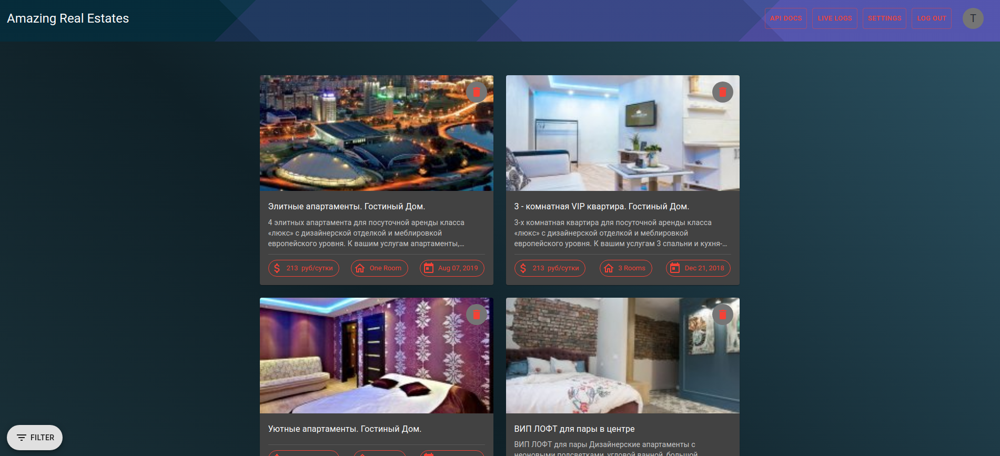

# Amazing Real Estates

## Description

App's backend is made with Laravel and the frontend React, Redux, Material-UI, Typscript  

## Live view

#### [https://ama.rrazvan.dev](https://ama.rrazvan.dev)

  

## Requierments
* php 7.4
* node-js
* yarn
* composer
* docker
* docker-compose
* mysql
* optional - Mailgun Api

## Install

### ./backend

* Create .env file in ./backend with your variables
* `composer install`
* `php artisan rr:parse-web-page` to fetch all posts

### ./frontend

* Create .env file in ./frontend with backends url
* `yarn install`

## Run Project

In ./backend
`php artisan serve`
In ./frontend
`yarn start`

## Build project with docker

* Create .env file in repo's root with your variables 
* `docker-compose up --build -d`

